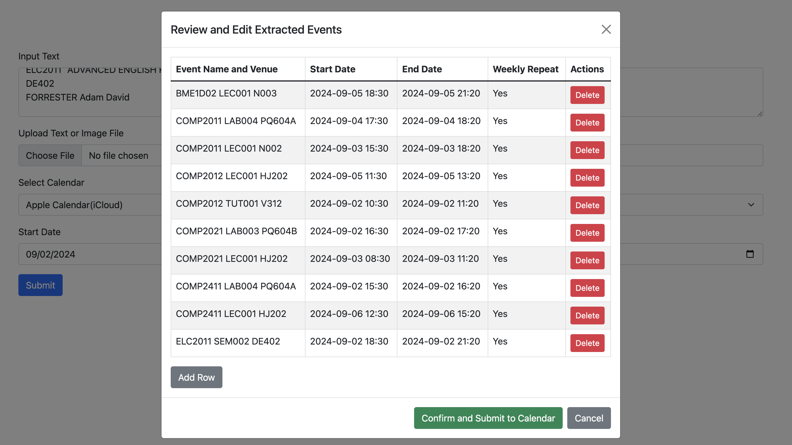
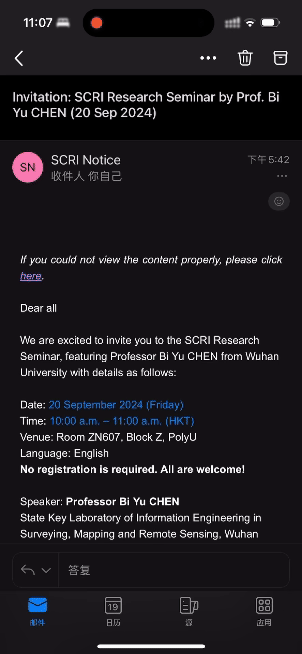
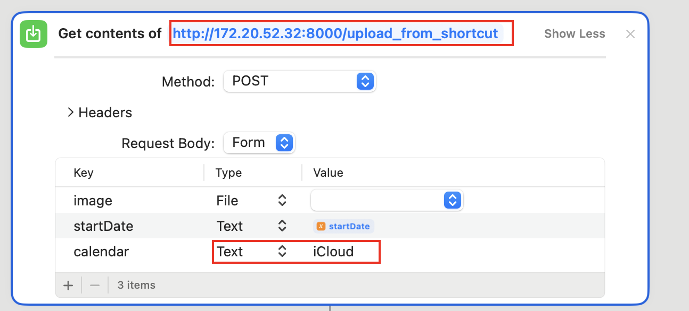

# AutoCalendar
Automatically extracts various event information from text or image and generates calendar events with concise titles, dates, and times, including alarms and weekly recurrence.

Support calendar: Apple Calendar(MacOS), Apple Calendar(iCloud).


### Demo

##### Web



##### Shortcut




### Usage

**Deploy**

``` bash
git clone https://github.com/ylxmf2005/AutoCalendar
```

```bash
cd AutoCalendar
pip install -r requirements.txt
```

```python
# Please create .env, and the following environment variables.
OPENAI_API_KEY=""
icloud_caldav_url = "" # If needed, see relevant links.
icloud_username = "" # If needed, can be email.
icloud_password = "" # If needed, must be app-specific passwords, see relevant links.
```

```bash
sh ./run.sh
# If you want to use Apple Calendar(MacOS), make sure your terminal has the permission to access calendars.
```

##### Shortcut

[Shortcut Link](https://www.icloud.com/shortcuts/b4eec63885524d809ec4f99a53975fd5)

Please modify the two values:



Watch the shortcut demo video for more details.

##### Relevant Links:

- [How to get icloud_caldav_url](https://www.reddit.com/r/Thunderbird/comments/1dpop9d/icloud_calendar_sync_without_addon_get_icloud/)
- [How to get icloud_password](https://support.apple.com/en-hk/102654)


### To Do List

- [x] Add Web GUI
- [x] Add Support for Apple Calendar(iCloud)
- [x] Add Integration with iOS Shortcuts
- [ ] Add Support for Outlook Calendar
- [ ] Add Support for Google Calendar
- [ ] Add database and account login function
- [ ] Add GUI for Windows, MacOS


### Acknowledgement

This project would not have been possible without with the support of the following(the order does not reflect the level of the gratitude):

- https://github.com/python-caldav/caldav

- gpt-4o

- gpt-o1-preview
